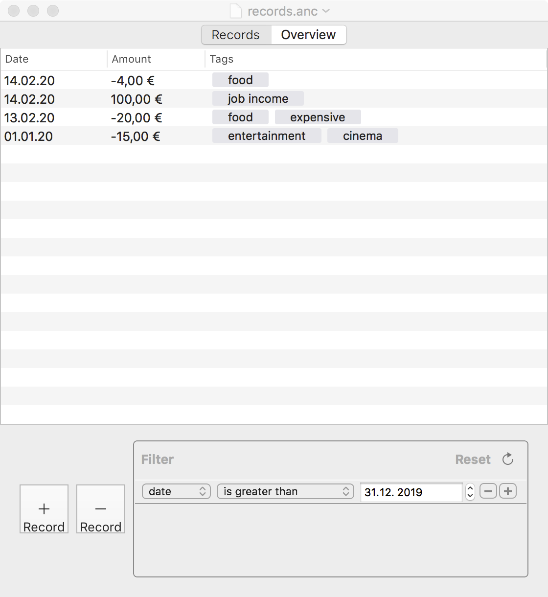
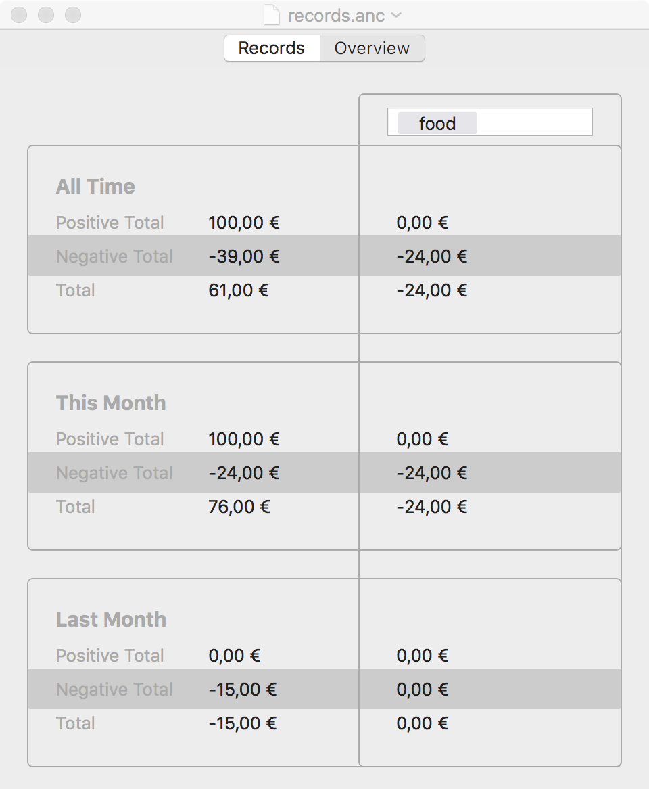
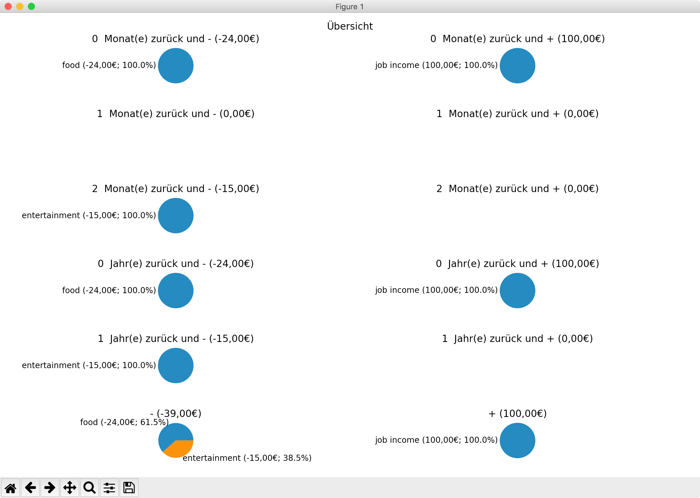
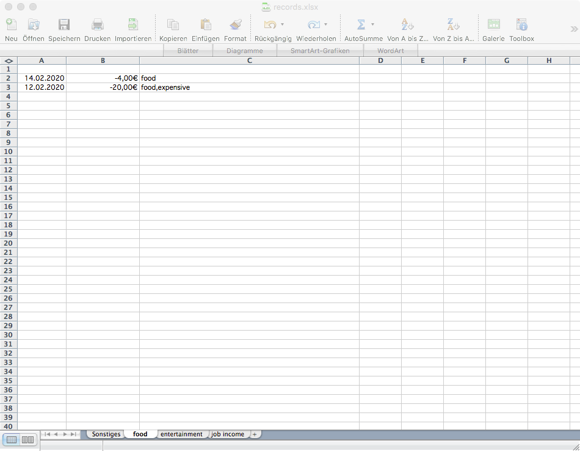

# Anchovy

features:

- keep track of accounting records
- save and load document
- get overview of totals

## Records
features:
- add record
- remove record
- tags for records
- filter by date, amount and/or tag



## Overview
features:
- show totals for current and last month
- filter by tags



# Plot Pie Charts
*requires: python 3.6+*
```
./anc_plot_pies.py <source.anc> [<tag_1> ... [<tag_n>] ]
```
Plots pie charts where each slice represents a `tag`.

features:
- plot totals sorted by tags as pie charts for various time intervals



# Convert to .XLSX
*requires: python 3.6+*
```
./anc_to_xlsx <source.anc> <target.xlsx> [<tag_1> ... [<tag_n>] ]
```
Converts the `.anc` to a `.xlsx`file where each worksheet represents a `tag`.



## Notes
- created with Xcode 8.2.1 on OS X 10.11.6
